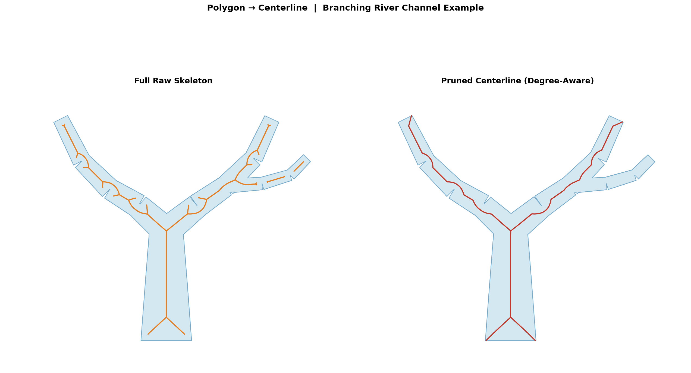

# Enhanced Polygon to Centerline

> **🌐 Language / 语言**:  [English](#enhanced-polygon-to-centerline) · [中文说明](README_CN.md)


An ArcGIS Python Toolbox that converts elongated polygon features (rivers,
roads, channels, corridors) into clean, branching centerline polylines — using
a **vector-based Voronoi skeleton** algorithm that requires only a Basic ArcGIS
license and no Spatial Analyst extension.

---

## Why Not Use the ArcGIS Native Approach?

ArcGIS offers two built-in ways to approximate a centerline from a polygon:

| Native method | How it works | Limitations |
|---|---|---|
| **Polygon to Centerline** (Cartography toolbox) | Internally builds Thiessen polygons, requires **Advanced** license | Advanced license only; no branch-aware pruning |
| **Least Cost Path** (Spatial Analyst) | Rasterises the polygon, computes a cost-distance raster, traces the minimum-cost path from one seed point to another | Raster resolution limits precision; traces **one path only** (no branching); requires Spatial Analyst extension; path length depends heavily on seed placement |

**Raster-based cost path — key limitations visualised:**

```
Polygon boundary (vector):          Rasterised grid (cell size = d):

  ╭──────────────────╮               ┌─┬─┬─┬─┬─┬─┬─┬─┐
  │                  │               │ │█│█│█│█│█│█│ │
  │                  │               ├─┼─┼─┼─┼─┼─┼─┼─┤
  │                  │               │ │█│█│█│█│█│█│ │
  ╰──────────────────╯               └─┴─┴─┴─┴─┴─┴─┴─┘

  • Shape is exact                   • Boundary "steps" by ±d
  • Cost path = staircased line      • Requires manually placing seed points
  • Branching polygons → single      • Precision ∝ 1/cell_size (slower & larger
    path only, branches lost           as resolution improves)
```

**Our toolbox solves all of these problems** by working entirely in the vector
domain using a Voronoi skeleton algorithm:

| Feature | Native LCP | **This toolbox** |
|---|---|---|
| Works on vector geometry | ✗ (rasterises) | ✅ |
| License required | Spatial Analyst | **None (Basic OK)** |
| Handles branching polygons | ✗ single path | ✅ full skeleton |
| Output precision | limited by cell size | **sub-vertex precision** |
| Speed (large dataset) | slow (raster ops) | **O(V + E) linear** |
| Seed points needed | yes | **no** |

---

## Tools in This Repository

| Tool | File | Purpose |
|---|---|---|
| **Degree-Aware Centerline** | `degree_centerline/Degree_Centerline.pyt` | Single-pass Voronoi skeleton extraction with degree-aware branch pruning |
| **Tiled Centerline** | `degree_centerline/Split_and_Process.pyt` | Same algorithm but with adaptive quad-tree tiling for large / country-scale datasets |
| **Proportional Buffer** | `proportional_buffer/arcpy_toolbox/Proportional_Buffer.pyt` | Generates variable-width buffer polygons where width ∝ local channel width at each cross-section |

---

## Quick Download

Pre-packaged zip files ready to load directly into ArcGIS Pro:

| Download | Contents |
|---|---|
| [**Degree_Centerline_Toolbox.zip**](downloads/Degree_Centerline_Toolbox.zip) | `Degree_Centerline.pyt` + `centerline_degree.py` + `Split_and_Process.pyt` + `split_and_process.py` + `install_dependencies.bat` |
| [**Proportional_Buffer_Toolbox.zip**](downloads/Proportional_Buffer_Toolbox.zip) | `Proportional_Buffer.pyt` (standalone, no extra dependencies) |

---

## Algorithm — How It Works

### Step 1 · Boundary Densification

The polygon boundary typically has too few vertices to produce a fine skeleton.
Extra vertices are inserted at a uniform spacing `d` (the **densify distance**).

```
Original boundary (4 vertices):     After densification (spacing = d):

  A ──────────────── B                A ─·─·─·─·─·─·─·─ B
  │                  │                ·                  ·
  │                  │                ·                  ·
  D ──────────────── C                D ─·─·─·─·─·─·─·─ C

  Voronoi of 4 pts → coarse           Voronoi of many pts → fine
  skeleton, misses interior detail    skeleton follows shape precisely
```

> **Implementation**: fully vectorised with `numpy.repeat` + cumsum — no
> Python loops over individual points.  Complexity: O(N).

---

### Step 2 · Voronoi Tessellation

All densified boundary points are fed to `scipy.spatial.Voronoi`.  Each
Voronoi **ridge** (the edge between two adjacent Voronoi cells) is a
candidate centerline segment.

```
Densified boundary points (·):        Voronoi diagram:

  · · · · · · · · ·                    · · · · · · · · ·
  ·               ·                    · ╲ │ │ │ │ │ ╱ ·
  ·               ·         →          ·  ╲│ │ │ │╱  ·
  ·               ·                    ·   ┼─┼─┼─┼   ·
  · · · · · · · · ·                    ·  ╱│ │ │ │╲  ·
                                        · ╱ │ │ │ │ ╲ ·
                                        · · · · · · · · ·

  Each boundary point "owns" a cell.  Ridges between cells are equidistant
  from two boundary points — naturally tracing the medial axis.
```

---

### Step 3 · Interior Ridge Filtering

Not all Voronoi ridges are useful.  Two filters remove noise:

1. **Interior test** — both ridge endpoints must lie inside the polygon
   (point-in-polygon batch test using ray casting).
2. **Generating-distance filter** — ridges whose two generating boundary
   points are very close together (distance < 3 × `d`) are on the same side
   of the polygon and produce noise spurs near convex corners; they are
   discarded.

```
All Voronoi ridges:                   After filtering:

  ─ ─ ─ ─ ─ ─ ─ ─                     (outside ridges removed)
  │ skeleton │                          ───────────────
  │ inside   │            →             │ clean      │
  │          │                          │ interior   │
  ─ ─ ─ ─ ─ ─ ─ ─                      skeleton    │
                                        ───────────────
```

---

### Step 4 · Graph Construction

Surviving ridges become edges in a `networkx.Graph`.  Node coordinates are
the ridge endpoints (rounded to avoid floating-point duplicates).  Edge
weights are Euclidean lengths.

---

### Step 5 · Degree-Aware Branch Decomposition

This is the key step that distinguishes this tool from a naive "longest path"
approach.

**Key-node identification:**

```
  Graph nodes by degree:

    ● degree 1 = leaf  (end of a branch)
    ◆ degree 2 = chain node (pass-through, no junction)
    ★ degree ≥ 3 = junction (branching point)
```

**Segment decomposition:**

```
  Raw skeleton graph:

    L1 ──·──·──·── J1 ──·──·──·── L2
                    │
                   ·──·──·── L3

    Decomposed into 3 topological segments:
      Seg A: L1 → J1  (length = sum of edge weights)
      Seg B: J1 → L2
      Seg C: J1 → L3
```

**Noise filtering:**

- Terminal segments (leaf → junction) shorter than
  `min_branch_ratio × reference_length` are removed as noise spurs.
- `reference_length = max(longest_segment, 0.5 × total_skeleton_length)`
  — this context-aware denominator prevents accidentally discarding long
  branches when many short ones are also present.
- Internal segments (junction → junction) are **always kept**.
- Terminal branches near obtuse polygon vertices (interior angle > 150°)
  are additionally removed **unless** they are ≥ 20% of total skeleton
  length (structural branches are protected).

```
  After filtering (min_branch_ratio = 0.10):

    Short noise spur L3 removed (length < 10% of reference):

    L1 ─────────── J1 ─────────── L2
        (clean, no noise spurs)
```

**Complexity**: O(V + E) — linear in the number of skeleton vertices and
edges, far faster than Steiner-tree or all-pairs shortest-path approaches.

---

### Step 6 · Output

Surviving edges are assembled into a `MULTILINESTRING` geometry and written
to the output feature class, preserving all attribute fields from the input
polygon layer.

---

## Installation

### Dependencies

| Package | Status in ArcGIS Pro | Notes |
|---|---|---|
| `numpy` | Pre-installed | — |
| `scipy` | Usually pre-installed | — |
| `networkx` | **Must install** | One command (see below) |
| `matplotlib` | Usually pre-installed | Optional; accelerates rasterisation |

### Quick install (recommended)

1. Open the **ArcGIS Pro Python Command Prompt**.
2. `cd` to the `degree_centerline/` folder (or the unzipped download folder).
3. Run `install_dependencies.bat`.

### Manual install

```
conda create --name arcgispro-py3-degree --clone arcgispro-py3
activate arcgispro-py3-degree
conda install -c conda-forge -y networkx
```

Then set `arcgispro-py3-degree` as the active environment in ArcGIS Pro
(**Project → Python → Python Environments**) and restart ArcGIS Pro.

> The Proportional Buffer toolbox needs **no extra dependencies** — `numpy`
> and `scipy` are already present in the default ArcGIS Pro environment.

---

## Usage Guide

### Tool 1 — Degree-Aware Centerline (`Degree_Centerline.pyt`)

1. Unzip `Degree_Centerline_Toolbox.zip`. Keep all files in the **same folder**.
2. In ArcGIS Pro **Catalog** pane → right-click a folder → **Add Toolbox** →
   select `Degree_Centerline.pyt`.
3. Run **Polygon to Centerline (Degree-Aware)**.

| Parameter | Description | Typical value |
|---|---|---|
| Input Polygon Features | Waterway / road / corridor polygon layer | — |
| Output Centerline Feature Class | Output path | — |
| Densify Distance | Vertex spacing for boundary densification (CRS units) | `1.0` – `5.0` m |
| Min Branch Ratio | Fraction of reference length below which terminal branches are pruned | `0.05` – `0.15` |
| Prune Threshold | Absolute length threshold for pre-pruning noise spurs | `0` (auto) |
| Return Full Raw Skeleton | If checked, skips degree-aware filtering | unchecked |

**Typical workflow:**

```
Input polygon layer  →  Degree-Aware Centerline tool  →  Centerline polylines
```

---

### Tool 2 — Tiled Centerline for Large Datasets (`Split_and_Process.pyt`)

For country-scale or very large polygon datasets (>8 000 boundary vertices per
feature), the single-pass algorithm can become unreliable.  This tool tiles the
input using an adaptive quad-tree and processes each tile independently:

| Phase | What it does |
|---|---|
| **A** — Component split | Each disconnected polygon part is processed independently |
| **B** — Quad-tree subdivision | Parts exceeding `max_vertices` are recursively split into four quadrant tiles |
| **C** — Overlap-buffer extraction | Each tile is expanded by `buffer_factor × densify_distance` before clipping, preventing spurious branches at tile seams |

Extra parameters (beyond Tool 1):

| Parameter | Description | Typical value |
|---|---|---|
| Max Vertices Per Tile | Vertex threshold for Phase B subdivision | `8000` |
| Buffer Factor | Overlap buffer = factor × densify distance | `5.0` |
| Max Quad-Tree Depth | Maximum recursion depth for Phase B | `5` |

---

### Tool 3 — Proportional Buffer (`Proportional_Buffer.pyt`)

Generates a variable-width buffer polygon along a pre-existing centerline,
where the buffer width at every cross-section equals
`buffer_ratio × 2 × local_half_width`.  The local half-width is measured
as the distance from the centerline sample point to the nearest polygon
boundary vertex (via `scipy.spatial.cKDTree`).

```
Typical two-step workflow:

  Step 1:  Run Degree-Aware Centerline tool
             Input:  waterway polygons
             Output: centerline polylines

  Step 2:  Run Proportional Buffer tool
             Inputs: original polygons + centerlines from Step 1
             Output: variable-width buffer polygons
                     (e.g. navigation channel, flood zone, riparian buffer)
```

| Parameter | Description | Default |
|---|---|---|
| Input Polygon Features | Source polygon layer | — |
| Input Centerline Features | Centerline polyline layer | — |
| Output Buffer Feature Class | Output path | — |
| Buffer Ratio | Fraction of local half-width per side (0 < r ≤ 1) | `0.5` |
| Sample Distance | Centerline sampling interval (CRS units) | auto |
| End-Cap Style | `ROUND` or `FLAT` | `ROUND` |
| Clip Buffer to Polygon | Clip output to source polygon boundary | checked |
| Chaikin Smoothing Iterations | 0 = no smoothing | `0` |

Load the toolbox:  **Catalog pane → Add Toolbox → `Proportional_Buffer.pyt`**.
No extra dependencies — works out of the box with any ArcGIS Pro installation.

---

## Repository Structure

```
Enhanced-Polygon-to-Centerline/
├── degree_centerline/          Latest centerline extraction toolbox (USE THIS)
│   ├── Degree_Centerline.pyt       Single-pass ArcGIS toolbox
│   ├── centerline_degree.py        Core algorithm
│   ├── Split_and_Process.pyt       Tiled ArcGIS toolbox for large datasets
│   ├── split_and_process.py        Tiling wrapper
│   ├── install_dependencies.bat    One-click dependency installer
│   ├── requirements.txt
│   ├── HOW_IT_WORKS.md             Detailed algorithm walkthrough (Chinese)
│   └── README.md
├── proportional_buffer/        Variable-width buffer toolkit (USE THIS)
│   ├── arcpy_toolbox/
│   │   └── Proportional_Buffer.pyt ArcGIS toolbox (standalone)
│   ├── proportional_buffer.py      Core algorithm (shapely/numpy/scipy)
│   ├── cli.py                      Command-line interface
│   ├── requirements.txt
│   └── README.md
├── downloads/                  Pre-packaged zip files (ready to download)
│   ├── Degree_Centerline_Toolbox.zip
│   └── Proportional_Buffer_Toolbox.zip
├── archive/                    Earlier experimental versions (for reference)
│   ├── arcpy_toolbox/
│   ├── auto_centerline/
│   ├── fast_centerline/
│   ├── gdal_centerline/
│   ├── pure_centerline/
│   └── steiner_centerline/
└── README.md                   This file
```

---

## Example Output


**Left — Full Raw Skeleton** (`Return Full Raw Skeleton` checked): all Voronoi
ridges inside the polygon are returned.  Short noise spurs are clearly visible
at every obtuse bend and where the tiny narrow tributaries join the main
channel.

**Right — Pruned Centerline** (default): the degree-aware branch decomposition
removes short terminal segments that are noise artefacts (< 10 % of the
reference skeleton length), while preserving every real tributary junction.
The small spurious branches at the kinks in the left arm, the right arm, and
the tiny narrow side tributaries are all cleaned up automatically.

---

## License

MIT License — free to use, modify and distribute.  See [LICENSE](LICENSE) 

